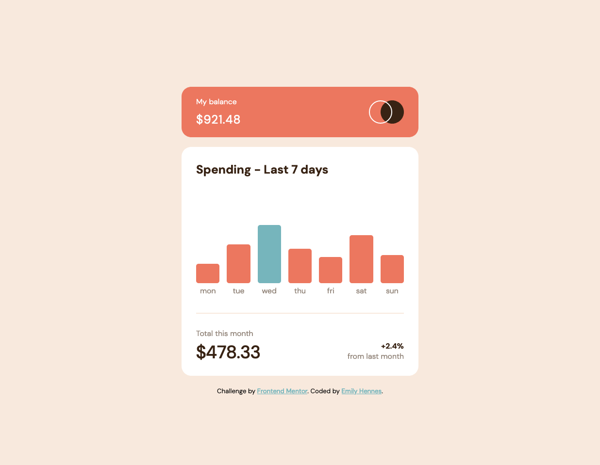

# Frontend Mentor - Expenses chart component solution

This is a solution to the [Expenses chart component challenge on Frontend Mentor](https://www.frontendmentor.io/challenges/expenses-chart-component-e7yJBUdjwt). Frontend Mentor challenges help you improve your coding skills by building realistic projects. 

## Table of contents

- [Overview](#overview)
  - [The challenge](#the-challenge)
  - [Screenshot](#screenshot)
  - [Links](#links)
- [My process](#my-process)
  - [Built with](#built-with)
  - [What I learned](#what-i-learned)
  - [Continued development](#continued-development)
  - [Useful resources](#useful-resources)
- [Author](#author)

## Overview

### The challenge

Users should be able to:

- View the bar chart and hover over the individual bars to see the correct amounts for each day
- See the highest spend day’s bar highlighted in a different colour to the other bars
- View the optimal layout for the content depending on their device’s screen size
- See hover states for all interactive elements on the page
- Use the JSON data file provided to dynamically size the bars on the chart

### Screenshot

### Links

- [Solution URL: ](https://github.com/ehennes/frontend-mentor-expenses-chart)
- [Live Site URL: ](https://eh-expenses-chart.netlify.app/)

## My process

### Built with

- Semantic HTML5 markup
- CSS custom properties
- Flexbox
- CSS Grid
- SCSS
- Vanilla JS
- Express.js
- NPM scripts 
- Browsersync 
- Concurrently
- Tippy.js

### What I learned

This projects highlights a workflow I would like to follow again for projects similar to this one, with one exception: I think a templating engine may have been helpful here for pulling in the data from the data.json file -- I ended up using data attributes, which did end up working fine. For more complicated charts/graphs in the future, I would most likely use a tool like highcharts over building it with CSS grid like I did here.

This is my first time usingthe following tools:
- Concurrently to run my npm scripts. I found it to be very helpful and easy to use! 
- node --watch instead of Nodemon. I really appreciated it and will continue to use it when I can.

### Continued development

Tools I will continue to use in future projects: 
- I would like to create my own template from my workflow here using express.js, npm scripts, concurrently, browsersync, and sass; potentially adding a templating engine as well. 
- I will continue to use Tippy.js for tooltips 
- I would like to continue to use the Fetch API and dive deeper into its functionality, as I know I barely scraped the surface of it in this project and in previous projects.

Future development for this project: 
- In the future, I would like users to be able to input their own numbers. The chart would still show the last 7 days of expenses, but it would have accurate and updated monthly totals based on users' own data, rather than from a static .json file. 

### Useful resources

- [Express.js docs](https://expressjs.com/) - These docs helped me get started on using Express, which I had not used for a while
- [MDN docs on Node and Express](https://developer.mozilla.org/en-US/docs/Learn/Server-side/Express_Nodejs/Introduction) - I really enjoy many of Mozilla's resources and this one is no exception. It was helpful for further fleshing out some of the concepts I needed for this project.
- [Browsersync command line usage](https://browsersync.io/docs/command-line) - This was very helpful for setting up browsersync in my package.json, since this was the first time I was setting it up outside of a gulp workflow. I still needed to google more specific examples, but I found it very useful to have all of the commands in one place.

## Author

- Website - [Emily Hennes](https://www.linkedin.com/in/emily-hennes/)
- Frontend Mentor - [@ehennes](https://www.frontendmentor.io/profile/ehennes)

